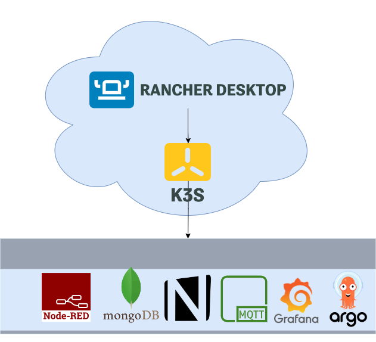

# naise-iaac-rancher-desktop

## Environment Overview:

# Pre-requisites

## Install Rancher Desktop from https://rancherdesktop.io

## Clone this repo to get access to the files

    git clone https://github.com/shebistar/naise-iaac-rancher-desktop

## Create Kubernetes resources using Rancher Desktop Dashboard GUI

Open Rancher Desktop Dashboard and create the namespace using the file [00_namespace.yaml](kubernetes/00_namespace.yaml) and the option Import YAML on the main screen:

Repeat the same process with files [01_app-naise_pvc.yaml](kubernetes/01_app-naise_pvc.yaml), [02_app-naise_deployment.yaml](kubernetes/02_app-naise_deployment.yaml) and [03_app-naise_service.yaml](kubernetes/03_app-naise_service.yaml)

# Test App

Using a browser go to http://localhost:32001 and you will see the UI

# TODO Grafana has some extra steps, due the need of copy the contents of the /var/lib/grafana in installer

# Mosquitto installation

First is to clone repository:

    $ git clone https://github.com/halkeye-helm-charts/mosquitto.git

Modify mosquito/values.yaml file, adding NodePort or LoadBalancer and enabling the storageClass.

    service:
        type: NodePort

    persistence:
        storageClass: "local-path"

If you want to map MQTT to a static port (Nodeport: 32003 in this case), modify mosquitto/templates/service.yaml file

      ports:
    - port: 1883
      nodePort: 32003
      targetPort: default
      protocol: TCP
      name: default

Run:

    helm install mosquitto --generate-name -n naise

